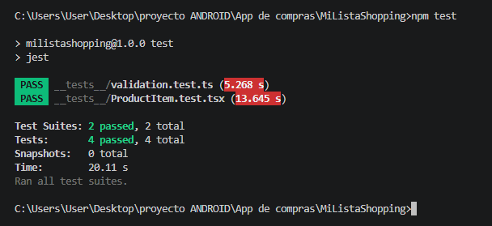

# MiListaShopping

Aplicación móvil desarrollada con React Native y Expo.

## Opción elegida

Lista de compras.

La aplicación permite registrar un usuario, iniciar sesión y administrar una lista de productos pendientes de comprar.

## Funcionalidades implementadas

- Registro de usuario.
- Login con validación de credenciales.
- Navegación entre pantallas con React Navigation.
- Acceso restringido a la aplicación hasta iniciar sesión.
- Cierre de sesión.
- Agregado de productos a la lista.
- Listado de productos.
- Eliminación de productos.
- Persistencia de usuario y productos mediante AsyncStorage.
- Componente reutilizable `ProductItem`.
- Notificación local de recordatorio de compras pendientes.
- Tests con Jest y React Native Testing Library.

## Tecnologías utilizadas

- React Native
- Expo SDK 57
- TypeScript
- React Navigation
- AsyncStorage
- Expo Notifications
- Jest
- React Native Testing Library

## Cómo ejecutar la aplicación

1. Clonar o descargar el repositorio.
2. Abrir una terminal dentro de la carpeta del proyecto.
3. Instalar las dependencias:

npm install

4. Iniciar Expo:

cmd

npx expo start

En mi entorno de desarrollo se utilizó túnel:

cmd

set NODE_PATH=C:\Users\User\AppData\Roaming\npm\node_modules
npx expo start --tunnel

Abrir Expo Go en un dispositivo Android y escanear el código QR.

## Video de demostración

[Ver video en YouTube](https://youtube.com/shorts/hHBS_pv7i4Y)

## Resultados de tests

## Notificación local

